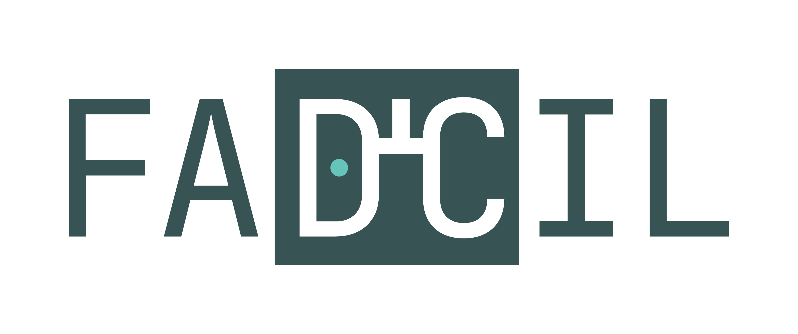
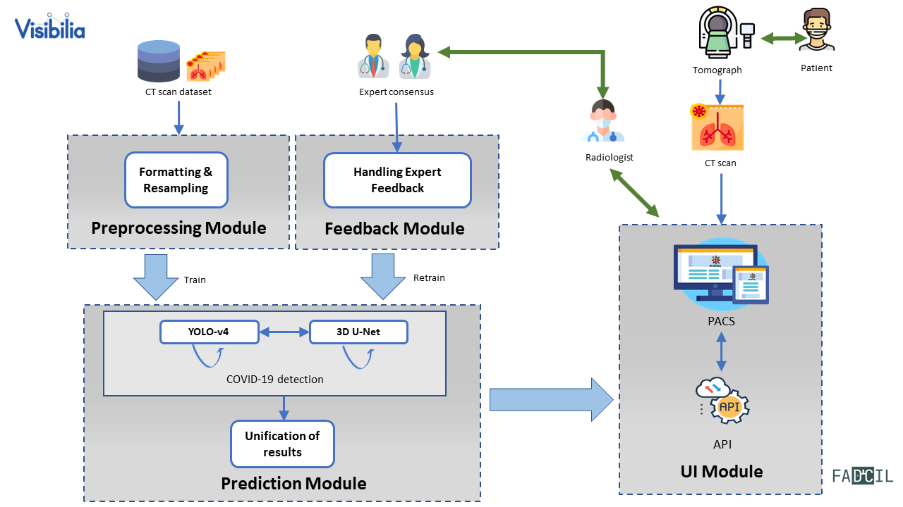
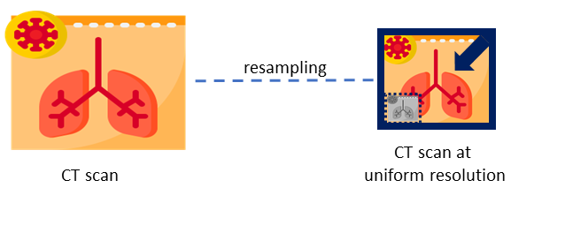
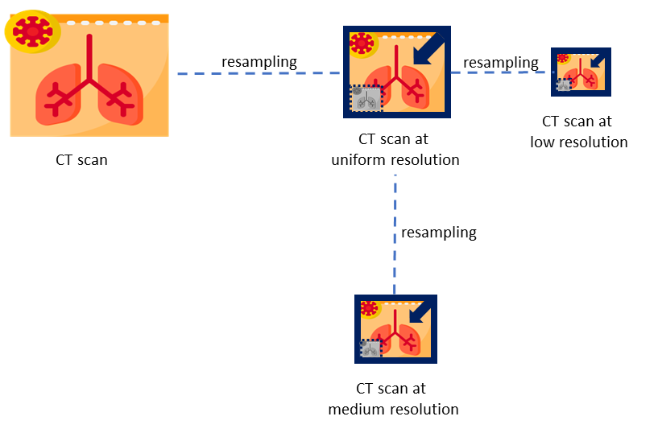
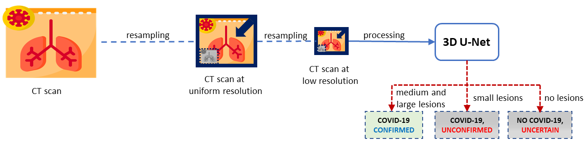
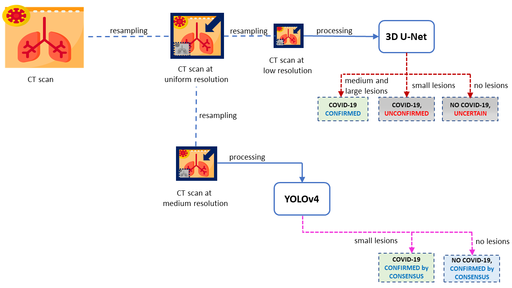
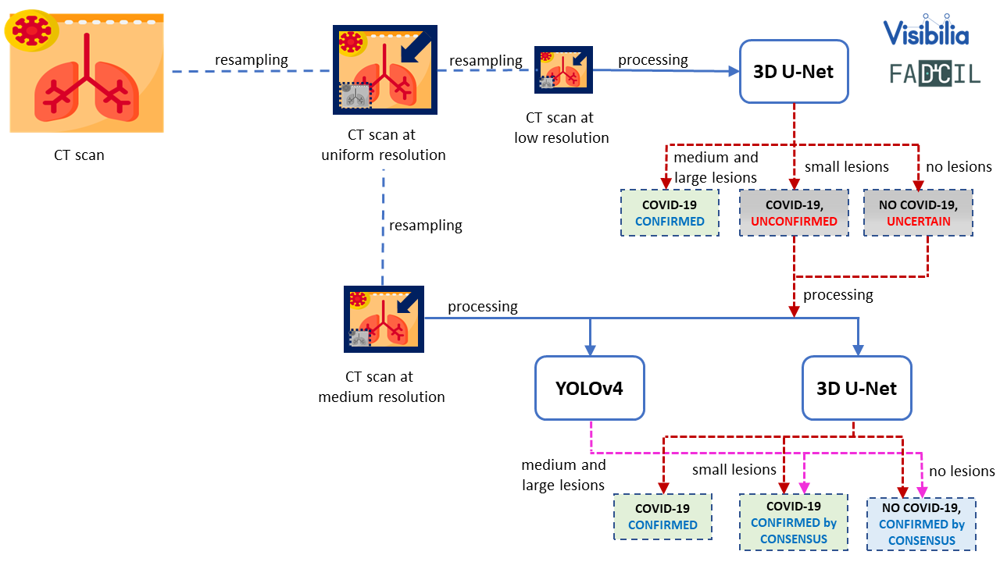

FADCIL: Fully Automatic Detection of Covid-19 cases in medical Images of the Lung
===============================================================================



Copyright (C) 2020-2024 `Visibilia`_

Welcome to the repository for **FADCIL** (Fully Automatic Detection of Covid-19 cases in medical Images of the Lung), a cutting-edge deep learning framework designed for the automatic detection of COVID-19 from chest CT scans. By integrating state-of-the-art architectures like **YOLOv4** and **3D U-Net**, FADCIL excels in accurately identifying and quantifying lung lesions caused by COVID-19, distinguishing them from other pulmonary diseases. This repository provides the source code and other materials for FADCIL as follows:

1. `Summary <#summary>`_
2. `Introduction <#introduction>`_
3. `System Overview <#system-overview>`_ 
4. `Deep Learning Networks Training <#deep-learning-networks-training>`_
5. `Running the Code <#running-the-code>`_
6. `Awards <#awards>`_
7. `Videos <#videos>`_
8. `Media Appearances <#media-appearances>`_
9. `Caution <#caution>`_
10. `Publication <#publication>`_
11. `Commercial Version <#commercial-version>`_
12. `Acknowledgment <#acknowledgment>`_
13. `Citation <#citation>`_


Summary
=========

The Coronavirus disease 2019 (COVID-19) pandemic has presented unprecedented challenges to global healthcare systems, urgently calling for innovative diagnostic solutions. This repository introduces the source code and other supplementary materials of **FADCIL** system, a cutting-edge deep learning framework designed for rapid and accurate COVID-19 diagnosis from chest computed tomography (CT) images. By leveraging an architecture based on **YOLO** and **3D U-Net**, FADCIL excels in identifying and quantifying lung injuries attributable to COVID-19, distinguishing them from other pathologies. In the real-world clinical environment of The Hospital das Clínicas de São Paulo (`HCFMUSP`_), Brazil, FADCIL achieved a DICE coefficient above 0.82. FADCIL also enhances the reliability of COVID-19 assessment, empowering healthcare professionals to make informed decisions and effectively manage patient care. Thus, this repository outlines the FADCIL source code, materials and presents an in-depth analysis of quantitative and qualitative evaluation results.


Introduction
============
The novel Coronavirus, SARS-CoV-2, emerged in late 2019, leading to a global pandemic with significant morbidity, mortality, and socioeconomic disruption. The virus's high contagion and severe respiratory effects posed major challenges to public health, requiring urgent responses from governments, healthcare institutions, and scientists. While RT-PCR tests are crucial for COVID-19 diagnosis, their reliability can vary. As a result, medical imaging, particularly chest CT scans, became a vital tool for COVID-19 detection due to their high sensitivity of up to 95%. This led to the integration of AI techniques for accurate and automated analysis of medical images. Deep learning, especially CNN-based models, has been highly effective in analyzing CT scans. However, models like YOLO and 3D U-Net have been less explored. 

At the beginning of the pandemic in Brazil, in April 2020, the São Paulo government and HCFMUSP launched a challenge to identify the best AI tool for diagnosing COVID-19 from medical images. The FADCIL system emerged as the leading solution, excelling in diagnosing COVID-19 from CT scans. FADCIL combines YOLOv4 and 3D U-Net architectures, enhanced through transfer learning, achieving competitive results. FADCIL performs precise lung segmentation and identifies COVID-19 lesions at various stages, distinguishing them from other conditions, mapping lesion locations, and quantifying lung impairment.

To ensure efficient cloud functioning, FADCIL uses a processing queue system and GPUs to minimize bottlenecks during real-time CT scan processing. Its exceptional performance and support to HCFMUSP’s medical teams during the pandemic gained significant attention and became the subject of an international case study.


System Overview
===============

FADCIL operates on the coronal, sagittal, and axial planes of patient data obtained from CT scans in  DICOM, NII, and NIfTI formats. FADCIL is structured into four main modules:  Preprocessing, Prediction, User Interface, and Feedback. The integration of these modules is illustrated in the following figure.




**Preprocessing Module**

This module directly handles CT scans,  preparing them for inference using deep learning models.  To accommodate potential format variations in the voxel spacing of CT scans, this module begins by compressing all inputs to the NIfTI format. Then, scans and reference masks are resampled to 0.75 x 0.75 x 0.8 mm resolution using cubic and nearest neighbor interpolation, respectively. This process is shown in the following figure.




From the uniform resolution, two new images are resampled: low resolution images with $3.0 x 3.0 x 3.2 mm and medium resolution images with 1.5 x 1.5 x 1.6 mmas 




**Prediction Module**

This module combines YOLOv4 and 3D U-Net models to improve the accuracy of COVID-19 detection. Resampled images with low resolution are processed by 3D U-Net. If 3D U-Net identifies large lesions characteristic of COVID-19, the diagnosis is confirmed. For cases involving smaller lesions or uncertain, the final diagnosis is determined by processing images at medium resolution. This process is shown in the following figure.





YOLO version 4 (YOLOv4) processes CT scans at medium resolution, focusing on work on identify the presence of the virus in small lesions or confirm the absence when there are no injuries. It is shown in the following figure.





COVID-19 diagnosis is only confirmed if 3D U-Net identifies large characteristic lesions of the disease. However, in cases where lesions are minimal or absent, the diagnosis of COVID-19 relies on consensus, meaning confirmation occurs only when both 3D U-Net and YOLOv4 are in agreement as shown in the final fiagram of YOLO and 3D U-Net integration at FADCIL prediction module shown in the following figure.





**User Interface Module**


FADCIL does not have its own user interface (UI) but enables integration with PACS (Picture Archiving and Communication System) or other CT scan visualization systems via the FADCIL API. Thus, segmentation results are saved in new scans, while classification and meta-information are stored in structured report (SR) files.


**Feedback Module**

Captures feedback from radiologists to refine and retrain the model, improving its accuracy over time. This is an optional module.


Deep Learning Networks Training 
==================================

**YOLO configuration for processing 3D images**

YOLO is adapted to process CT scans by treating the 3D image as a stack of multiple 2D slices. Thus, we employ three separate YOLOv4 networks, each dedicated to a specific plane of the human body: axial, coronal, and sagittal. This approach allows each YOLOv4 network to independently detect 2D bounding boxes, ensuring comprehensive coverage across different anatomical planes. The resulting bounding boxes are then consolidated through a process of region overlap, yielding unified 3D regions that identify COVID-19-related abnormalities.

Our YOLO networks analyze all slices of CT scans at medium resolution. We employ the YOLOv4 implementation built upon the `DarkNet`_ framework to train for ~20 hours our YOLO networks until achieve the networks with best results, which are:

- YoloV4-Axial network: with mAP of 0.714;
- YoloV4-Coronal network: with mAP of 0.596;
- YoloV4-Sagittal network: with mAP of 0.693.

We note that all YOLOv4 networks can readily distinguish the lungs, as most slices contain at least one lung. However, the presence of COVID-19 is often undetected in many slices, resulting in the trained YOLOv4 networks being unable to discern lesions caused by COVID-19 by themselves. Thus, we merge the bounding boxes generated by the YOLOv4-Axial, YOLOv4-Coronal, and YOLOv4-Sagittal networks into a 3D reconstruction of volumes. Subsequently, we derived a unified and accurate probability for detecting COVID-19. Thus, two YOLOv4-3D networks are generated:

- YOLOv4-3D weighted: formed by assigning 0.4, 0.22, and 0.38, as weights for YOLOv4-Axial, YOLOv4-Coronal, and YOLOv4-Sagittal networks, respectively;
- YOLOv4-3D averaged: formed by assigning equal weights to the three networks.

The two YOLOv4-3D networks allow the identification of lung regions where 2 or all 3 YOLOv4 networks agree on the outcome. This approach is highly effective in filtering out false positives due to the consensus of at least two YOLO networks. More details in our published paper (see here `publication`_).


**3D U-Net configuration**

By learning from annotations provided by human experts, which may vary, the 3D U-Net network can effectively capture intricate features within medical images. We utilize the 3D U-Net network to process both low and medium-resolution images. Due to the significant memory demands of the 3D U-Net, each scan is partitioned into patches. To handle border regions that extend beyond the CT scan, we employ mirroring techniques within the patches. Upon completion of the process, we combine all the patches to reconstruct the prediction to match the original CT scan size.

To minimize the false positive rate, a perfect Dice score of 1 is required when both the neural network prediction and the reference mask indicate the absence of injuries caused by COVID-19. We utilized the 3D U-Net implementation from the Keras framework in Python to train two 3D-U-Net networks:

- 3D U-Net only for COVID-19: network trained only with reference masks of COVID-19 cases;
- 3D U-Net for other cases: network trained with reference masks of diseases other than COVID-19 as well as imaging findings like opacities.

More details in our published paper.


**Integrating YOLOv4 and 3D U-Net**

After extensive testing, we determined the optimal combination of YOLO and 3D U-Net trained networks to obtain the following weights for our unified network configuration:

- 64% for YOLOv4-3D weighted;
- 24\% for YOLOv4-3D averaged;
- 8\% for 3D U-Net only for COVID-19;
- 4\% for 3D U-Net for other cases.

Feature vectors, comprising lesion sizes and categorization results obtained from the unified configuration, are utilized to train an XGBoost classification model. On the other hand, the final segmentation model combines the two 3D U-Net networks.


Running the Code
=================

To run the FADCIL code, you need to set up the appropriate programming environment. The source code is written in Python and R, and the necessary dependencies are listed in the following files:

- **Python Dependencies**: `requirements.txt`
- **R Dependencies**: `requirements-R.txt`

### Steps to Run the Code:

1. **Set Up Environment**:
   - Install the required Python packages using: 
     ```
     pip install -r requirements.txt
     ```
   - Install the necessary R packages and other software as specified in `requirements-R.txt`.

2. **Execute the Scripts**:
   - **Segmentation**:
     - Run `unet3D_keras_segmentation.py` to segment lungs and detect COVID-19 lesions from CT scans.
   - **Classification**:
     - Use `final-classification.R` to compute the probability of COVID-19 presence based on features extracted by the segmentation script.
   - **Configuration**:
     - Ensure `yolov4-covid_classification.cfg` is configured with the correct parameter values for the deep nets used in the segmentation script.

### Expected Outputs:

- **Binary Classification**: Outputs labeled with **1** (COVID-19) or **0** (not COVID-19), along with a probability score.
- **Segmentation**: Binary mask indicating the positions of the lesions.

### Additional Tasks:

- **Input Reading**: Implement necessary code to read CT scans in formats like DICOM, NII, or NIfTI.
- **Pre-processing**: Optionally, add code to clean or prepare the data according to specific requirements.
- **Post-processing**: Optionally, adjust the results to match specific formats or specifications.
- **Visualization**: Optionally, add code to visualize the results graphically.


Awards
========

FADCIL was developed as part of the `Challenge nº 03/2020 <https://ideiagov.sp.gov.br/desafios/diagnostico-atraves-de-imagens-de-tomografia-computadorizada-e-raio-x-de-torax/>`_ launched by the São Paulo State Government, aimed at finding AI solutions to assist radiologists in diagnosing COVID-19 from CT and X-ray images. After rigorous evaluation, **Visibilia** was selected as the winner of this challenge. This recognition was officially published in the `Official Press of the Sao Paulo State Government <https://www.imprensaoficial.com.br/DO/BuscaDO2001Documento_11_4.aspx?link=%2f2020%2fexecutivo%2520secao%2520i%2fagosto%2f15%2fpag_0028_0f4ec73d9ce98efebbb9ba398e36dc0e.pdf&pagina=28&data=15/08/2020&caderno=Executivo%20I&paginaordenacao=100028>`_ on August 15, 2020.


Videos
========

Watch FADCIL related video here:

- `Overview of FADCIL <https://www.youtube.com/watch?v=5MC5czxMdQM&list=PLxCzFuDeosTlrlphQ8-oZyMpYCLmMy4bA&index=1>`_
- `Paper presentation at CBMS 2024 by Dr. Jorge Valverde-Rebaza <https://event.fourwaves.com/cbms2024/abstracts/a7c37654-93f1-439b-a5de-77e8f47ba45b>`_


Media Appearances
==================

FADCIL has been featured in various media outlets and publications:

- `Visibilia Blog - FADCIL Overview <https://visibilia.net.br/category/fadcil/>`_


Caution
=========

The results generated by FADCIL should not be used directly in clinical settings without appropriate validation and approval by medical professionals.


Publication
============
See scientific publications related to FADCIL:

- "Integrating YOLO and 3D U-Net for COVID-19 Diagnosis on Chest CT Scans" at IEEE 37th International Symposium on Computer-Based Medical Systems (CBMS 2024). Access via: IEExplore at `CBMS IEEExplore 2024 paper'_  and ResearchFate (free access) at `CBMS 2024 paper`_.


Commercial Version
==================
Visibilia offers a commercial version of FADCIL, enhanced for clinical use. The commercial version includes additional features such as low refusal rate, high-speed processing, DICOM structured report files, and secure integration with existing clinical platforms.

- For more information, visit our `FADCIL product page <https://visibilia.net.br/fadcil>`_.

.. image:: https://visibilia.net.br/wp-content/uploads/2020/11/fadcil-lung-covid19-visibilia-winner.png
   :width: 600px
   :align: center


Acknowledgment
===============

We thank the following institutions: `HCFMUSP`_, `InRad`_, `Inova HC`_, Intituto de Pesquisas Tecnológicas (`IPT`_), `Instituto Tellus`_, `IdeiaGov`_, Secretaria de Desenvolvimento Econômico do Estado de São Paulo (`SDE`_), `AWS`_, Fondo de Apoyo a Publicaciones (FAP) from `Tecnologico de Monterrey`_, and Inter-American Development Bank (`IDB`_).


Citation
=========

If you use FADCIL in your research, please cite our paper:

.. code-block:: bibtex

    @inproceedings{valverde:fadcil:cbms24,
      title={Integrating YOLO and 3D U-Net for COVID-19 Diagnosis on Chest CT Scans},
      author={Valverde-Rebaza, Jorge and Andreis, Guilherme R and Shiguihara, Pedro and Paucar, Sebastián and Mano, Leandro Y and Góes, Fabiana and Noguez, Julieta and Da Silva, Nathalia C},
      booktitle={Proceedings of The IEEE 37th International Symposium on Computer-Based Medical Systems},
      series = {CBMS 2024},
      pages = {15--20},
      year={2024},
      doi = {10.1109/CBMS61543.2024.00011},
      publisher={IEEE}
    }


.. _Visibilia: https://visibilia.net.br 
.. _HCFMUSP: https://www.hc.fm.usp.br/hc/portal/
.. _DarkNet: https://github.com/AlexeyAB/darknet
.. _InRad: https://inrad.hc.fm.usp.br/
.. _Inova HC: https://inovahc.hc.fm.usp.br/
.. _IPT: https://ipt.br/
.. _Instituto Tellus: https://tellus.org.br/
.. _IdeiaGov: https://www.saopaulo.sp.gov.br/tag/ideiagov/
.. _SDE: https://www.desenvolvimentoeconomico.sp.gov.br/
.. _AWS: https://aws.amazon.com/pt/health/healthtech/
.. _Tecnologico de Monterrey: https://tec.mx/en/research
.. _IDB: https://www.iadb.org/es/proyecto/BR-T1457
.. _CBMS 2024 paper: https://www.researchgate.net/publication/381767923_Integrating_YOLO_and_3D_U-Net_for_COVID-19_Diagnosis_on_Chest_CT_Scans
.. _CBMS IEEExplore 2024 paper: https://ieeexplore.ieee.org/document/10600915
